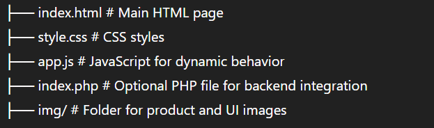

# Online E-commerce Platform for Shoes

# Nike Store Landing Page

A modern, responsive, and interactive single-page Nike product showcase built with HTML, CSS, JavaScript, and optional PHP backend.

## 🖼 Preview

An interactive e-commerce landing page featuring:

- Product slider with transitions
- Color and size selection
- Checkout popup form
- Responsive layout for mobile and desktop
- Clean UI with animations

## 📁 Project Structure




## 🚀 Getting Started

### Prerequisites

- A web browser (Chrome, Firefox, etc.)
- Optional: A PHP server (like XAMPP, WAMP, or PHP built-in server)

### Running Locally

1. Clone or download the repository.
2. Place all files and folders (including `/img`) in your web server directory (or just open `index.html` in a browser for static view).
3. For dynamic use or form handling, run:


php -S localhost:8000
Then open http://localhost:8000/index.php in your browser.

###🛠 Technologies Used
HTML5

CSS3 (including Flexbox and media queries)

Vanilla JavaScript (DOM manipulation)

PHP (optional)

##📦 Requirements
See requirements.txt for libraries and environments (mainly for backend integration).

##📄 License
This project is licensed under the MIT License – see the LICENSE file for details.

---

### ✅ `requirements.txt`

```txt
# No external libraries required for frontend
# If using PHP server:
PHP >= 7.0

# Optional (for local development):
# Install XAMPP/WAMP/LAMP or run built-in PHP server:
# php -S localhost:8000


